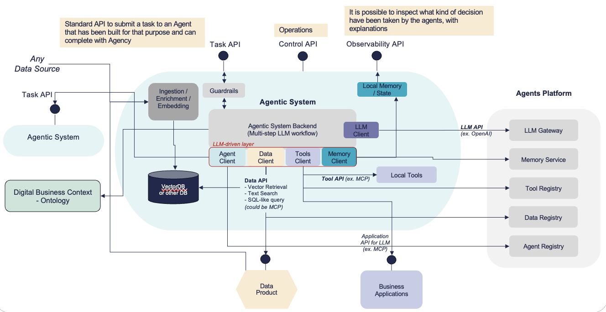

# Agent Descriptor Specification

This repo hosts the specification for **Agent Descriptors**. These descriptors define the attributes of different **agent components** that can be used within an **agentic system**. These components allow for modular, reusable structures that enable the agent to interact with data, execute actions, and enforce policies.





## Specification

The specification is also available as [OpenAPI 3.0 endpoints](agent-specification.yaml), to create the foundation of an **Agent Descriptor Registry**.

📄 **[Read the full Agent Descriptor Specification](spec.md)**


Examples of an agent can be found in the [examples](examples) directory.


## How to run validation

1. [Install](https://docs.astral.sh/uv/getting-started/installation/) `uv` package manager.

2. Run this command from the repo's root folder to validate the example descriptor:

```sh
./scripts/validate_model.sh
```

If you change the Agent Descriptor Specs  (`agent-specifications.yaml`), you need to regenerate the pydantic models used for validation with:

```sh
./scripts/generate_model.sh
```

## Roadmap

- [x] Define the specification
- [x] Create OpenAPI 3.0 endpoints
- [ ] Launch site
- [ ] Create a reference implementation
- [ ] Implement authentication and authorization mechanisms
- [ ] Support for multi-agent coordination
- [ ] Implement storage backends
<!-- - [ ] Launch public registry -->
<!-- - [ ] Implement search APIs -->
<!-- - [ ] Improve documentation and developer guides -->

---

For improvements, open an issue or submit a pull request. 🚀
