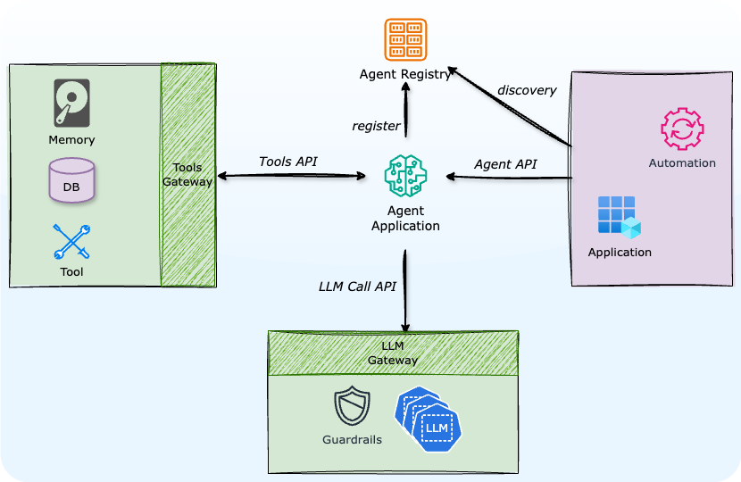

# Agent Descriptor Specification

This repo hosts the specification for **Agent Descriptors**. These descriptors define the attributes of different **agent components** that can be used within an **agentic system**. These components allow for modular, reusable structures that enable the agent to interact with data, execute actions, and enforce policies.

If you're looking for the written form specification head [here](spec.md).

The specification is also available as [OpenAPI 3.0 endpoints](openapi.yaml), to create the foundation of an **Agent Descriptor Registry**.

Examples of an agent can be found in the [examples](examples) directory.

## Roadmap

- [x] Define the specification
- [x] Create OpenAPI 3.0 endpoints
- [ ] Launch site
- [ ] Create a reference implementation
- [ ] Implement authentication and authorization mechanisms
- [ ] Support for multi-agent coordination
- [ ] Implement storage backends
- [ ] Launch public registry
- [ ] Implement search APIs
- [ ] Improve documentation and developer guides

---

For improvements, open an issue or submit a pull request. 🚀
